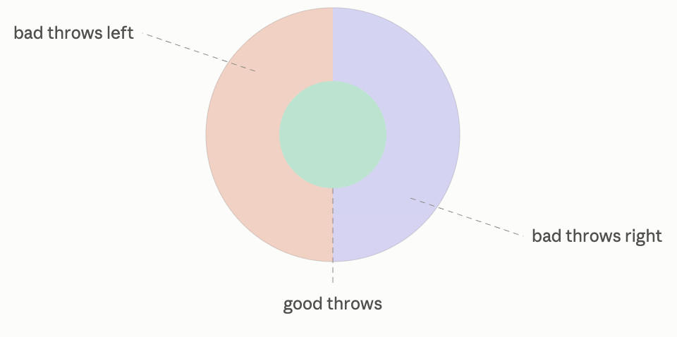

# Probability

## Experiment

For the purposes of this discussion, a process that can have a different outcome every time it is repeated can be thought of as an experiment. If I flip two coins - the outcome will be one of $HH, HT, TH, TT$. Or let's say I roll a single die - the outcome will be one of $1, 2, 3, 4, 5, 6$. 

### Sample Space

The set of all possible outcomes is called the **sample space**. It is denoted by $\Omega$ and each outcome within it by $\omega$. $\Omega$ can only be constructed out of *mutually exclusive* outcomes, i.e., only one of the outcomes can actually occur; and the outcomes have to be *exhaustive*, i.e., exactly one of the outcomes must occur. When we learn that a specific outcome $\bar \omega$ has occurred, it is called the *realized outcome*.

In both the above examples, the sample space has a finite number of elements. Let's take some examples where this is not the case. 

Consider a dart board. I am interested in figuring out where my dart throw is going to land. I can choose my sample space to consist of each and every point on the dart board, which is uncountable, but it is still bounded by the circular rim of the board. Even though the sample space is uncountable, the outcome of this experiment is still a single position on the dart board.

Alternatively, if I am only interested in distance from the center of my dart, then I can coarsen my sample space to be the interval $[0, R]$, which is also uncountable but bounded. Here too, the outcome will be a single real number from this interval. I don't really care about which point on the circle my dart lands, so my sample space definition throws that information away.

Uncountable sample spaces are not always so conveniently bounded. Take for example an experiment where I walk outside, stare at the night sky, and start a stopwatch. I stop the watch the exact moment I see a shooting star. It could be 12.347 seconds before I see one, or 12347.98 seconds, or I might wait forever. There is no upper bound. The set of all possible values that I will end up waiting is $[0, \infty)$.

An interesting set is one that is countably infinite. Let's say our experiment is that we keep tossing a coin until we get a heads. The sample space will look like $\Omega = \{H, TH, TTH, TTTH, \dots\, TTTT\dots\}$, theoretically there is no end, I can keep getting an infinite number of tails. In any case, I can give each outcome an integer ID, an index, if you will. This makes it countable. In this case there is no end in sight, which makes it unbounded.

Another example of a countably infinite sample space is the set of all possible wait times before a software system retries a failed operation. Let's say the software system has 1 second to process an operation, if it fails, it retries in half the time it originally waited. Before making the first attempt it waits $\frac{1}{2}$ seconds, before making the second attempt it waits $\frac{1}{4}$ seconds, before the third it waits $\frac{1}{8}$ seconds and so on. The set of all possible wait times is $\{1, \frac{1}{2}, \frac{1}{4}, \frac{1}{8}, \dots\}$. As before I can give each attempt an integer ID. This makes it countable. Unlike the above case, the entire set fits inside $[0, 1]$ seconds, so it is bounded.

#### Countability and Boundedness

Think of sets along two axis - countability and boundedness. On the countability axis the set can have elements that are:

* Finite: which are always countable.
* Uncountable: which are always infinite.
* Countably infinite: where we can give an integer ID to each element, but there are an infinite number of them.

The boundedness axis only applies when elements are numeric, they can be:

* Bounded: where there is a lower and/or upper bound. Numeric finite sets are always bounded.
* Unbounded: where either bound is absent.

|               | Finite   | Countably Infinite | Uncountable   |
| ------------- | -------- | ------------------ | ------------- |
| **Bounded**   | Die roll | Operation retries  | Dart board    |
| **Unbounded** | N/A      | First heads        | Shooting star |

### Choosing Sample Spaces

Do not conflate infinite elements in the sample space with whether the quantity we are interested in measuring is continuous or not. Let's say we want to analyze students in our local high school. The sample space consists of our student roster, which has a finite number of students in it. The outcome will be a single student, but their height will be a continuous value. 

Now let's say we are interested in analyzing the general high school student population in our County and we don't have access to the roster of each and every high school. Further, we are interested in only four attributes of each student - their grade, GPA, height, and weight. Now, our sample space cannot be our local high school's student roster, because our outcome needs to accommodate students who might not be in this particular high school. We widen our sample space to be the cross product of $\{9, 10, 11, 12\} \times [0, 4] \times [3, 7] \times [30, 300]$ for grade x GPA x height (between 3ft and 7 ft) x weight (between 30 lbs to 300 lbs). This is a mixture of finite and infinite spaces. Think of this as four cubes, one for each grade. Each cube is bounded on all three axes. 

The contrast with the local high school scenario is that there the sample space was finite, but measurements - like height - on individual outcomes (each student) was continuous, whereas in the County scenario, the sample space itself is uncountable, and each individual outcome is a dot in one of the cubes.

### Joint Analysis

As a final example, let's look at a practical scenario. Let's say I want to measure the Queries Per Second (QPS) hitting my web server. The minimum number of queries I'll see in a 1-second window is $0$, and the maximum will be some theoretical maximum depending on the throughput, say $N$. I can define my sample space as the integers $\Omega = \{0, 1, 2, 3, \dots, N\}$. An outcome $\omega$ will be a single number from this set, and I can use it to measure QPS. I can also set up a second, mathematically identical sample space, let's call it $\Omega'$, to measure unique sessions per second. Without any semantic definition, the set of first $N$ integers works fine for both.

However, if I want to jointly analyze requests and sessions, I cannot just reuse the single set $\Omega = \{0, 1, \dots, N\}$  for both measurements at the same time. Why? Because in a joint analysis, a single outcome $\omega$ must hold enough information so that both the number of requests and the number of sessions can be extracted from it. If our outcome is just the number $100$, what does it mean? If we say that it means the request count, how many sessions did we see? The number $100$ does not tell us. In the real world, $100$ requests could have come from a single session, or they could've come from 100 different sessions. A single integer doesn't have the capacity to hold both pieces of information simultaneously. To jointly analyze them, we'll need a richer sample space - one where a single outcome can capture both the requests and sessions at once. A trivial enrichment of our sample space can be the cross-product of $\Omega \times \Omega'$. Because you cannot have more sessions than requests, an entire triangle from the diagonal can be skipped, so we can optionally tighten the sample space to be $\{(\omega_1, \omega_2): \omega_i \in \mathbb W, \omega_1 \ge \omega_2\}$, where $\mathbb W = \{0, 1, \dots, N\}$. 

However, every time I expand my experiment to include other things that I want to measure, like the max latency in 1-second window, HTTP response status, bytes downloaded, etc. we will need to keep enriching the sample space. One good way to get all of that is if we can set up a sample space that is all the trace logs collected in 1-second windows. Each log can collect the following:

* Start-Timestamp: $[0, \infty)$
* End-Timestamp: $[0, \infty)$
* User Agent: $\{$ millions of different strings $\}$
* Content-Length: $\{0, 1, \dots, B\}$, $B$ is the largest sized web page our web server serves.
* HTTP status: $\{100, 101, \dots, 200, 201, 202, \dots, 300, 301, 304, \dots, 400, 401, 404, \dots, 500, 502, \dots, 511\}$ 
* User ID: UUID4 which can have $2^{122}$ distinct elements.
* Trace ID: UUID4 which can have $2^{122}$ distinct elements.

Each outcome will be a table, with each row in the table being a structured trace log. The table will have at most $N$ rows. Don't think of the sample space as the concrete collection of partitioned logs you have stored! Sample space is this conceptual space that is very very large. Each log can be thought of as an element of the set of all possible logs $L$, which will be the cross-product of all the attributes we are collecting. A 1-second window will be an ordered collection of such logs. It can have no logs, 1 log, 2 logs, up to N logs. Our sample space will be the set of all such collections. Mathematically we can write $\Omega = L^0 \cup L \cup L^2 \cup L^3 \cup \dots L^N$ which can also be written as $\bigcup_{k=0}^N L^k$.

## Probability

Probability is not some actual property that exists, e.g., a coin does not have some probability attribute that I can read out in one-shot. It is a model, and like all scientific models, its purpose is to help us predict the future, or predict how some system will behave given some initial conditions. We can define probability as long-running frequencies, because we have found that it is useful in predicting the next outcome, or we can define it as the degree of our belief, for similar reasons. Unlike physical models whose inputs are direct physical measurements, probability's inputs are themselves abstract, they are frequencies that only exist across many repetitions, or in the case of Bayesian reading - degrees of belief - which are even more removed than frequencies. An interesting definition of probability I came across was by the Italian mathematician de Finetti - probability is the price you'd pay for a gamble where you receive $\$1$ if the event occurs, or conversely the price you'd charge for a gamble where you pay out $\$1$ if the event occurs.

### Event Space

Probabilities are defined for events, not outcomes. An **event** is a collection of outcomes, i.e., it is a subset of the sample space, $E \subseteq \Omega$. Probability of an event tells us how *likely* it is for one of the outcomes contained within it to happen. Remember, outcomes are mutually exclusive, so only one of the outcomes contained within it can happen. We can wrap a single outcome in a singleton set and call it an event. While $\omega$ is not an event, $\{\omega\}$ is! These are called **singleton events**.

The definition of probability we have so far uses the word "likely" which is just another synonym for probability. To get a more rigorous definition, let's first understand the concept of the **event space** $\mathscr F$, which is a set of events, i.e., it is a set of subsets of $\Omega$ which follows the following three rules:

* It must contain $\Omega$ itself.
* It must be closed under complementation, i.e., if it contains some event $E$, then it must also contain that event's complement $E^c$.
* It must be closed under countable unions, i.e., if $E_1, E_2, \cdots$ is a countable collection of events in $\mathscr F$, then their union must also be in $\mathscr F$.
* Corollary: By the last two rules, the intersection of $E_1, E_2, \cdots$ must also be in $\mathscr F$.

Let's see how the corollary works for two events $A, B \in \mathscr F$ - by the complementation rule, $A^c$ and $B^c$ must also $\in \mathscr F$. By the countable unions rule $(A^c \cup B^c) \in \mathscr F$. By the complementation rule again, $(A^c \cup B^c)^c \in \mathscr F$ . However $(A^c \cup B^c)^c = (A \cap B)$. 

> [!TIP]
>
> In measure theory, these rules make $\mathscr F$ a $\sigma-$algebra on $\Omega$.

For the die-roll experiment, the most straightforward event space that I can construct is the full powerset of $\{1, 2, 3, 4, 5, 6\}$ with all 64 elements. It will contain singleton events like $\{1\}, \{3\}, \dots$, as well as other events like $\{2, 5, 6\}, \{3, 4\}, \dots$. It will meet all the three rules. For completion under countable unions, I can union any arbitrary number of events, and it will still be in the event space.

Alternately, I can also define an event space as follows:

* $E$ an even number appears face-up, i.e., $E = \{2, 4, 6\}$
* $O$ an odd number appears face-up, i.e., $O = \{1, 3, 5\}$

I can define $\mathscr F = \{E, O, \Omega, \emptyset\}$. It obviously contains $\Omega$; each event's complement is in $\mathscr F$, $E$ and $O$ are complements of each other, $\Omega$ and $\emptyset$ are complements of each other. I can pick any number of events from these four, and their union will be in $\mathscr F$. All three rules are met.

A useful recipe for building event spaces is to use "atoms":

1. Partition the sample space into the smallest possible "interesting" events. The total number of such events must be countable, and the events themselves must be disjoint, i.e., no outcome is present in multiple events. These events are called atoms.
2. Add all the atoms to the event space $\mathscr F$.
3. Take all possible unions of the atoms, and add the unions back to $\mathscr F$.

We will end up with a valid event space that follows all three rules. Obviously no proper non-empty subset of the atoms will be in $\mathscr F$. 

Sample spaces that are countable to begin with have singleton events that are also countable; and they are disjoint, thus can become atoms. Upon unioning them we will end up with an $\mathscr F$ that is the full powerset of $\Omega$. In the operation retries example, we take all the singleton events $\{\frac{1}{2}\}, \{\frac{1}{4}\}, \{\frac{1}{8}\}, \dots$ and union all possible combinations - $\{\frac{1}{2}\} \cup \{\frac{1}{8}\} \cup \{\frac{1}{64}\}$, $\{\frac{1}{32}\} \cup \{\frac{1}{128}\}$, etc. - add everything to $\mathscr F$.  Or we can select some other subset as our atoms - like we did above with $E$ and $O$, and build $\mathscr F$ from that.

> [!TIP]
>
> The powerset of a countably infinite sample space is uncountable.

This recipe can also be applied to uncountable sample spaces. Let's take the toy example of our dart board to illustrate this. Our sample space is $\Omega = \{(\omega_1, \omega_2): \omega_1^2 + \omega_2^2 \le R^2\}$ where $R$ is the radius of the board. Each dot on the dart board is an outcome. Any region of the sample space that we can "shade" constitutes a valid event. And if we can partition the sample space into disjoint and countable regions, we have our atoms. For example:

With these three atoms - $L$ bad throws to the left, $R$ bad throws to the right, and $G$ good throws, we can create an event space that has $2^3 = 8$ events. $\mathscr F = \{L, G, R, \Omega, \emptyset, L \cup G, L \cup R, G \cup R\}$. 

> [!TIP]
>
> In rigorous measure theory, these familiar, "shadable" geometric regions (along with 1D lines and 0D points that bound them) are formally known as **Borel sets**.

What we **cannot** do for uncountable sample spaces is use singleton events as atoms. There are uncountably many of them. We cannot simply throw every conceivable union of such points into $\mathscr F$ (doing so breaks math via paradoxes like the [Vitali Set](https://en.wikipedia.org/wiki/Vitali_set)). If we want singleton events in $\mathscr F$, we follow a different recipe using a structure called Borel $\sigma-$algebra. Don't let the name intimidate you. Here are the steps for the dart board:

1. Start with all the "nice, sensible" shapes inside the dart board: every possible rectangle, every little circle, every slice of the pie, etc.
2. According to event space rules, we must include the shapes' complements, their countable unions, and countable intersections.
3. Do this infinitely many times, and everything we could possibly ever want to measure ends up in our event space.

The generated $\mathscr F$ contains:

* Every **2D area** (the bullseye, the "triple 20" bed, the left half of the board).
* Every **1D line or curve** (the metal wire separating the beds).
* Every **0D singleton** (every exact, infinitely small dot on the board)

### Probability Measure

Probability can now be defined as a function that assigns a real number to each event in an event space. The function $P$ is called a **probability measure** if it meets the following three conditions:

* Non-negativity: $P(E) \ge 0$ for all events
* Sure thing: $P(\Omega) = 1$ ( $\Rightarrow P(\emptyset) = 0$ )
* Sigma-additivity: $P(E_1 \cup E_2 \cup \cdots) = P(E_1) + P(E_2) + \cdots$ where $E_i$ are all mutually exclusive a.k.a **disjoint** events.
* Corollary $\Rightarrow 0 \le P(E) \le 1$ by the first three rules.

For the die-roll example, if we assign the probability as follows:

$$
P(E) = \frac{1}{2} \\
P(O) = \frac{1}{2} \\
P(\Omega) = 1 \\
P(\emptyset) = 0
$$

It can be seen that it follows all three rules of the probability measure, and is therefore a valid assignment. However, because our event space cannot resolve anything finer than even/odd, we cannot assign a probability to anything finer either: $\{6\}$ and $\{1, 2\}$ aren't events in $\mathscr F$, so $P$ - whose domain is $\mathscr F$ - has nothing to evaluate.

When designing $P$ on larger event spaces, I don't actually have to take each event and assign a number to it. I can specify the probability of few simple pieces and every other event will fall in place. 

If my $\mathscr F$ is composed of countable atoms, then we need to assign positive non-zero probability to some or all of the atoms, ensuring that the sum is $1$. When the countable atoms are singleton events, $P$ is said to have a **discrete** distribution, otherwise $P$ is said to have **atomic** distribution. But the basic idea is the same. 

In case of the local high school, we had a finite sample space, which gives us an event space composed of singleton events of individual students. We can assign a uniform probability of $1/1200$ to each singleton event. The sum of the probabilities of all singleton events is $1200 \times \frac{1}{1200} = 1$. Now using the additivity of probability, we can output a probability for any event in the event space. 

In the first-heads example, we can assign the first singleton $P(\{H\}) = \frac{1}{2}$, the second singleton $P(\{TH\}) = \frac{1}{2^2}$, the third singleton $P(\{TTH\}) = \frac{1}{2^3}$, and so on till infinity. We can verify that the probabilities over these countably infinite singletons sum up to $\frac{1}{2} + \frac{1}{4} + \frac{1}{8} + \dots = \frac{\frac{1}{2}}{1 - \frac{1}{2}} = 1$. Again, by the law of additivity of probability, we now have the probability defined for all possible events in this event space. However, we cannot have uniform distribution here, because there is nothing to divide by.

Our singleton assignments do not have to be so mathematically neat. In the operation-retry example, let's say our policy is to have only three retries, after which we raise an error. In this case we can assign the first attempt $P(\{\frac{1}{2}\}) = 0.5$, the second attempt $P(\{\frac{1}{4}\}) = 0.3$, the third attempt $P(\{\frac{1}{8}\}) = 0.2$, and the rest of the attempts a probability of $0$. However, we cannot have a uniform distribution across all possible retries here, because there is no infinite denominator to "divide" by.

In the earlier dart-board example, we saw that we can have countable atoms in an event space with an uncountable sample space, when we partitioned the dart board into $L, R, G$ events. We can now assign probabilities to these events  as $P(G) = 0.6, P(L) = 0.3, P(R) = 0.1$ for a reasonably good player, or we could've said $P(G) = 0.1, P(L) = 0.4, P(R) = 0.5$ for a particularly bad player. We could've assigned these uniformly by dividing the event area by the total area of the board, but we don't have to.

In the dart-board example we were able to create discrete (or strictly speaking atomic) probability distributions because of the presence of countable atoms in the event space. If we don't have that, if we have uncountably many point singletons - one for each point on the board - we have more options on how to assign $P$. 

* The first is the discrete assignment we have seen so far. Let's say we have a history of a 100 dart throws by this particular player. We can assign a non-zero positive mass to each of these 100 points (summing to $1$ of course), and $0$ to every other singleton point. This way, any region that contains one or more of these points will have the sum of the contained points as its probability. 
* Secondly, we can define a continuous distribution where we assign $0$ probability to all the singleton events, and define a density function on the sample space, which will output a value for each outcome, and have its integral answer the probability question for any region in question. We can also assign uniform probability by dividing the region area with the total area.
* A third option is to have a mixed distribution - where a single singleton event, like the bullseye can have some positive non-zero mass, let's say $0.01$, and the other regions' probability is given by the density function.

What we cannot do is give a non-zero positive mass to all the singleton events, because then their sum will blow past $1$. Practically, we rarely write $P$ or $f$ down by hand. We pick a parametric family of functions whose shape matches our experiment, and estimate the parameters from existing data. While probabilities are functions over $\mathscr F$, densities are functions over $\Omega$.

* $P: \mathscr F \rightarrow [0, 1]$
* $f: \Omega \rightarrow [0, \infty)$ the return value is not a probability

The bridge is integration: $\int_A f(\omega) d\omega$ so $f$ is not a probability assignment, it can be interpreted as probability per unit area.

|               | Finite                                                       | Countably Infinite                                           | Uncountable                                                  |
| ------------- | ------------------------------------------------------------ | ------------------------------------------------------------ | ------------------------------------------------------------ |
| **Bounded**   | $P$ must be discrete. $P$ can be uniform (e.g., 1/n per point) | $P$ must be discrete. $P$ cannot be uniform, there is no denominator. | $P$ can be anything (discrete, continuous, mixed). $P$ can be uniform (divide by area) |
| **Unbounded** | N/A                                                          | $P$ must be discrete. $P$ cannot be uniform, there is no denominator. | $P$ can be anything (discrete, continuous, mixed). $P$ cannot be uniform (nothing to divide by) |
