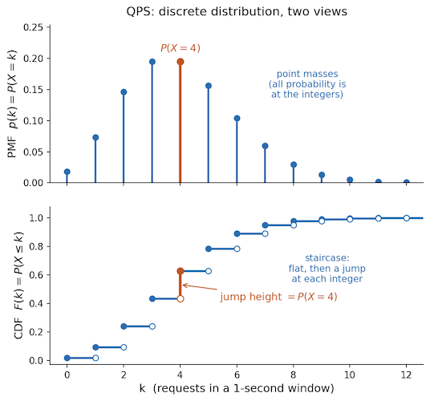
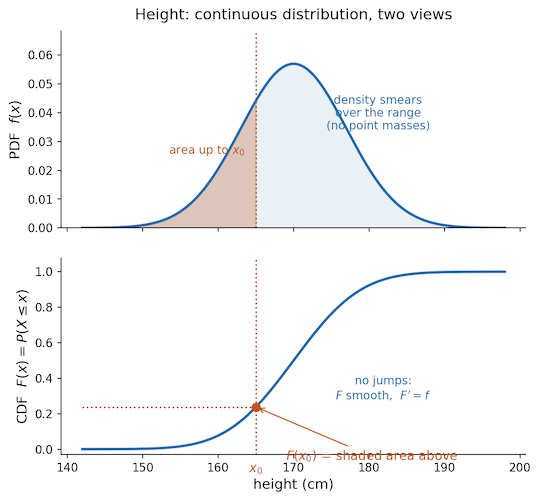
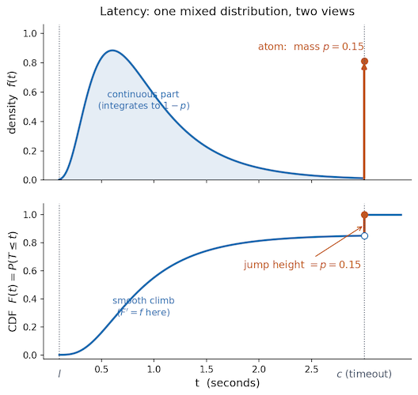

# Probability

## Experiment

A process that can have a different outcome every time it is repeated can be thought of as an experiment (for the purposes of this discussion). Lets say I flip two coins - the outcome will be one of $HH, HT, TH, TT$.   Or lets say I roll a single die - the outcome will be one of $1, 2, 3, 4, 5, 6$. The set of all possible outcomes is called the sample space, denoted by $\Omega$, and each outcome is denoted by $\omega$. $\Omega$ can only be constructed out of **mutually exclusive** outcomes, i.e., only one of the outcomes can happen; and the outcomes have to be **exhaustive**, i.e., at least one of the outcomes must happen. When we learn that a specific outcome $\bar \omega$ has actually happened, it is called the **realized outcome**.

Lets motivate the rest of this tutorial with a real world scenario.

#### Microservices Telemetry

Lets say I am running a news web app. My architecture is pretty simple, a single Frontend service (FE) gets the user request, fans it out to two other services - Ads and Newsfeed (NF) - in parallel using separate connection pools. Both these downstream services are pretty self-contained and running on separate infrastructure, making them relatively independent of each other. The only thing they have in common is the traffic load. The Ads service recommends ads to send to the user, the Newsfeed service assembles their news feed. If the total processing time for the FE is taking too long, it will abort the request with a `504 Gateway Timeout` response. This is what a gunicorn worker timeout setting would do. 

Lets say I want to measure Queries Per Second (QPS). The minimum number of queries I'll see in a 1-second window will be $0$, and the maximum will be some theoretical maximum depending on the network bandwidth, lets say $N$. I can define my sample space like this $\Omega = \{0, 1, \dots, N\}$. An outcome $\omega$ will be a single number from this set. I can use this sample space to measure QPS.   I can set up another sample space that looks exactly like $\Omega$, lets call it $\Omega'$, and use it to measure the unique sessions per second. The lower and upper bounds work because if $N$ is the upper bound of requests, it will also be the upper bound of sessions. Mathematically, both the sample spaces are the same construct. However, if I want to do joint analysis on sessions and requests, I cannot use the sample space the way it is defined. This is because there is a semantic meaning attached to the sample space - if it means the number of requests in a second, it cannot simultaneously mean the number of sessions in a second as well. And for reasons that will become clear when we discuss jont distributions, if I want to jointly analyze multiple measurements, they must come from the same sample space. To jointly analyze sessions and requests, we will need to define our sample space such that we can make both the measurements from the same space.

To do so lets set up telemetry to capture the full trace of each and every request that hits the FE. The trace will capture the following information:

* Timestamp
* User Agent
* Content-Length
* HTTP status
* User ID
* Request ID
* Session ID
* FE-Start-Timestamp
* FE-End-Timestamp
* Ads-Start-Timestamp
* Ads-End-Timestamp
* NF-Start-Timestamp
* NF-End-Timestamp
* Next-Action
* ...

Now, I can create different sample spaces from this telemetry depending on my needs. 

* Group the logs into 1-second intervals based on their timestamp. This will enable me to measure things like QPS, unique sessions per second, total bytes downloaded per second, all from a single sample space. 
* Group the logs by their Session ID which will enable me to measure business metrics like the Click-Through-Rate (CTR), bounce rate, dwell time, etc. 
* I can even keep the sample space as a collection of individual traces without any partitioning. From this I can measure things like the latency; whether the request originated from a mobile, a tablet, or a PC; etc.

I can think of the sample space as a bunch of tables, with each row in a table being a single log, $\Omega = \{(l_{11}, l_{12}, \dots), (l_{21}, l_{22}, \dots), \dots\}$. It will be a mistake to think of the sample space as consisting of the logs that I have captured so far. Most trivially, logs that I capture tomorrow will have different timestamps, so they will necessarily not be drawn from this faulty sample space. Moreover, the actual sample space is very very large, the timestamp fields can have any value from $(0, \infty)$,  the UUID4 fields can take any one of the $2^{122}$ values, etc. Each row in each table is drawn from the cross-product of the field ranges, and a table is a sequence of up to $N$ such rows, so the size of $\Omega$ is that product raised to $N$. Yes, large!

Randomly sampling a value from this space is akin to selecting a collection of logs $\omega = (l_{i1}, l_{i2}, \dots)$, not a single number like we have seen so far.  Having a single sample space that can enable different measures is useful when we want to do joint analysis of different measures.

In this real-life setting, the sample space is not a neat mathematical set, like the one we saw in the die-roll setting. Here it is a complex object that will have to be further processed in order to extract relevant information out of it. And the space of individual elements can be discrete - like the number of requests in a 1-second window, continuous like latency, or categorical like the user agent.

## Probability

Probability is not some actual property that exists, e.g., a coin does not have some probability attribute that I can read out in one-shot. It is a model, and like all scientific models, its purpose is to help us predict the future, or predict how some system will behave given some initial conditions. We can define probability as long-running frequencies, because we have found that it is useful in predicting the next outcome, or we can define it as the degree of our belief, for similar reasons. Unlike physical models whose inputs are direct physical measurements, probability's inputs are themselves abstract, they are frequencies that only exist across many repetitions, or in the case of Bayesian reading - degrees of belief - which are even more removed than frequencies. An interesting definition of probability I came across was by the Italian mathematician de Finetti - probability is the price you'd pay for a gamble where you receive $1$ if the event occurs, or conversely the price you'd charge for a gamble where you pay out $1$ if the event happens.

Probabilities are defined for events, **not** outcomes. An event is a collection of outcomes, i.e., it is a subset of the sample space, $E \subseteq \Omega$. Probability of an event tells us how likely it is for one of the outcomes contained within it to happen. Remember, outcomes are mutually exclusive, so only one of the outcomes contained within it can happen. But this definition of probability uses the word "likely" which is just another synonym for probability. To get a more rigorous definition, lets first understand the concept of the event space $\mathscr F$, which is a set of events, i.e., it is a set of subsets of $\Omega$ which follows the following three rules:

* It must contain $\Omega$ itself.
* It must be closed under complementation, i.e., if it contains some event $E$, then it must also contain that event's complement $E^c$.
* It must be closed under countable unions, i.e., if the events $E_1, E_2, \cdots$ are part of $\mathscr F$, then their union must also be in $\mathscr F$.

> In measure theory, these rules make $\mathscr F$ a $\sigma$-algebra on $\Omega$. There are some cases where some subset of  outcomes are not considered events and cannot be part of $\mathscr F$. For discrete spaces, a full powerset of $\Omega$ is a valid event-space, but for continuous spaces, this is not always the case. The set of outcomes called the Vitaly Set is not a valid part of the event space.

For the die-roll experiment, the most straightforward event space that I can construct is the full powerset of $\{1, 2, 3, 4, 5, 6\}$ with all 64 elements. It will meet all the three rules. For completion under countable unions, I can union any arbitrary number of events, and it will still be in the event space.

But I can also define an event space as follows:

* $E$ an even number appears face-up, i.e., $E = \{2, 4, 6\}$
* $O$ an odd number appears face-up, i.e., $O = \{1, 3, 5\}$

I can define $\mathscr F = \{E, O, \Omega, \emptyset\}$. It obviously contains $\Omega$; each event's complement is in $\mathscr F$, $E$ and $O$ are complements of each other, $\Omega$ and $\emptyset$ are complements of each other. I can pick any number of events from these four, and their union will be $\Omega$, which is also in $\mathscr F$. All three rules are met.

Probability can now be defined as a function that assigns a real number to each event in an event space. The function $P$ is called a **probability measure** if it meets the following three conditions:

* Range: $0 \le P(E) \le 1$
* Sure thing: $P(\Omega) = 1$, corrollary $P(\emptyset) = 0$
* Sigma-additivity: $P(E_1 \cup E_2 \cup \cdots) = P(E_1) + P(E_2) + \cdots$ where $E_i$ are all mutually exclusive a.k.a **disjoint** events.

For the die-roll example, if we assign the probability as follows:

$$
P(E) = \frac{1}{2} \\
P(O) = \frac{1}{2} \\
P(\Omega) = 1 \\
P(\emptyset) = 0
$$

It can be seen that it follows all three rules of the probability measure, and is therefor a valid assignment.

Colloquially speaking, when we say something like $P(HH)$, the probability of a single outcome, what we mean is the probability of a singleton event with only that outcome in it, i.e., $P(\{HH\})$. And we can always construct an event space with this singleton as one of its event, the powerset is one such event space.

The probability space is defined as the triple $\Omega, \mathscr F, P$, where $\Omega$ and $\mathscr F$ are sets and $P$ is a function. 

##### Impossible and Zero Probability

For discrete spaces, e.g., in the die-roll experiment we might get $P(7) = 0$, if we had defined the sample space to include $7$. This would mean that it is impossible to get $7$. But for continuous spaces, a zero probability event does not imply impossibility. Lets say we measure the latency as 2.384 seconds. A singleton event, i.e., an event with a specific value $\{2.384\}$, is a valid member of the event space but its probability measure is $0$. This does not mean it can never happen, in fact it did just happen! The only impossible event for continuous spaces is the $\emptyset$. This is why, for continuous spaces, we like to deal in probabilities of ranges, because they can have positive probability. Of course, not all intervals will have positive non-zero probability. E.g., latency will have zero probabality for negative ranges like $(-5, -3)$. Another weirdness for continuous spaces is that there are certain outcome sets like the Vitaly set that are not a valid part of any event space, these are neither impossible nor possible. They don't have a probability measure, so it makes no sense to ask whether they are possible or not. 

## Continuous and Discrete Spaces

Asking whether a quantity is continuous is an abstraction over three concrete questions:

* Is the quantity I am measuring truly continuous?
* How sensitive is my measurement apparatus?
* Is the distribution continuous?

#### Latent Quantity

Think of a person's height, or how long a request really took. In reality these are smooth quantities — a request could take 0.1 seconds or 0.10001 seconds or anything in between. There's no gap between allowed values. This is what we mean by continuous, and for the real underlying quantity it's a perfectly fine thing to believe.

#### Measurement Apparatus

The moment you measure, you use an instrument, and every instrument has a smallest step. A stopwatch might only show hundredths of a second. A ruler only shows millimeters. So even though the true height is smooth, your recorded number always lands on one of a finite list of values — 170 mm, 171 mm, 172 mm, never 170.4839 mm. So strictly speaking, measured data is always a bit chunky, never perfectly smooth. We usually pretend it's continuous anyway, because the chunks are so tiny they don't matter. But this can be quantified, i.e., there is a mathematical way to answer whether or not the chunkiness is negligible.

Lets say the tiniest value my measurement apparatus can measure is $h$, then according to Sheppard's correction, my varainace will be affected as:

$$
\sigma_{obs}^2 \approx \sigma_{act}^2 + \frac{h^2}{12}
$$

My observed variance will be an overestimate over my actual variance. To figure out whether the chunkiness is negligible, I can compare $h$ with either $\sigma$. Lets say I am measuring heights of some population. The smallest length my scale can measure is $1$ mm, then $h = 1$. And the standard deviation of heights is $\sigma = 2.8" \approx 70mm$ (per National Health Survey), i.e., $\sigma^2 = 70\;mm * 70\;mm = 4900\;mm^2$, and $\frac{h^2}{12} = \frac{1}{12} = 0.0833 \;mm^2$. If we compare the two $\frac{0.0833}{4900} \approx 0.000017 = 0.0017\%$, unarguably tiny!

On the other hand, typical latency dashboards like Grafana lump all requests into a few wide buckets of around 250 ms. It is almost as wide as the values that I care about. Here pretending that things are smooth and reading off a "precise" number off that bucket is clearly misleading.

Sometimes, even if the chunkiness is not very small, we can still pretend that the measurements are smooth depending on the quantity we are interested in. If we are computing averages, chunkiness mostly wash out. But if I am calculating the 99 percentile of latency, where I only have a few data points to begin with, chunkiness can be a real problem.

#### Distribution

The first two questions were about the world and about the instrument. This one is about the probability measure itself. And since probability is assigned to events and never to outcomes, the real question is - **which events carry probability?** Concretely: can a singleton event carry any at all, or do I need an event with some width to it?

* **Discrete**: singleton events carry positive probability. The event "exactly 23 requests arrived in this window" has a real chunk of probability sitting on it. QPS is inherently discrete, so probability piles up on the integers with nothing in between.
* **Continuous**: every singleton event has probability $0$, and only events with positive width carry any mass. This is the situation from *Impossible and Zero Probability* above - measuring a latency of exactly 2.384 seconds is entirely possible, but that singleton event still measures $0$. Height is like this; the measurement chunkiness is negligible and no single value's probability dominates.
* **Mixed**: mostly the continuous story, but a handful of singleton events do carry positive mass. Recorded latency is this - the event "the request timed out" is the singleton $\{c\}$, and it carries genuinely positive probability because every timed-out request records exactly $c$.

## Random Variable

==TODO==

Consider the two-coin-flip experiment, I can define a random variable that counts the number of heads in the outcome -

| Outcome | Random Variable |
| ------- | --------------- |
| $HH$    | 2               |
| $HT$    | 1               |
| $TH$    | 1               |
| $TT$    | 0               |

I can also define another random variable that indicates whether the outcome had at least one head -

| Outcome | Random Variable |
| ------- | --------------- |
| $HH$    | 1               |
| $HT$    | 1               |
| $TH$    | 1               |
| $TT$    | 0               |

Or, another random variable that indicates whether the first coin is heads -

| Outcome | Random Variable |
| ------- | --------------- |
| $HH$    | 1               |
| $HT$    | 1               |
| $TH$    | 0               |
| $TT$    | 0               |

You get the idea. I can define any function that assigns a real value to each and every outcome in the sample space. This function is called a **random variable** $X: \Omega \rightarrow \mathbb R$, i.e., $X(\omega) \in \mathbb R$.  As seen in the examples above, the function does not necessarily assign a **unique** real valued label to each outcome, the value can be duplicated. The value that the random variable function $X$ outputs is called its **realization**, often denoted by $x$, i.e., $X(\omega) = x$.

A text book example is often rolling a single die, then $\Omega = \{1, 2, 3, 4, 5, 6\}$, and the random variable $X$ is defined as the number of the face-up side, i.e., $X(\omega) = \omega$, i.e., it is the identity function.

**Support** of a discrete random variable $X$, written as $R_{X}$ or $supp(X)$, is the set of values with non-zero probability: $\{x: P(X=x) > 0\}$. This sounds very much like the **range** of a function, and these concepts are related. Range is a property of the function alone (which values can it output), while support is a property of the distribution (where the probability actually is). The support is never larger than the range, and in most cases they are the same. The support differs in cases where some attainable value carries zero probability, e.g., when rolling a loaded die that will never roll a 6, the range is stil $\{1, 2, 3, 4, 5, 6\}$ but the support is $\{1, 2, 3, 4, 5\}$. This is a useful distinction because something having a probability of $0$ is a much stronger claim than simply not observing a particular value in the sample. Consider a Naive Bayes classifier set up. The vocuabulary is composed of all possible words in the corpus, but in my training set some words do not appear at all. Assuming that these words have a probability of $0$ is dangerous because I am very likely to see these words show up in my testset and my entire classifier will collapse. This is why I need to smooth out the probabilities in practice.

For probabilities, the main purpose of the random variable is to group outcomes into events. E.g., if my random variable is the number of heads in the coin toss experiment, $P(X = 1)$ is shortcut for saying $P(\{\omega: X(\omega) = 1\})$, which is nothing but $P(\{HT, TH\})$. For discrete variables the probability $P(X = x)$ is the same as $P(X(\omega) = x)$, which in turn is shortform for $P(\{\omega: X(\omega) = x\})$ i.e., the probability of an event where the outcome will measure exactly $x$. This can refer to a single outcome or an event that comprises of multiple outcomes, all having the same value. E.g., if I want to represent the probability of whether the die roll is even or not, the event is the set of outcomes $\{2, 4, 6\}$ and I'd write it as $P(X = 2 \;or\; 4 \;or\; 6)$. For continuous variables we measure probability of intervals instead, and when we say $P(x_1 < X < x_2)$ what we mean is $P(\{\omega: x_1 < X(\omega) < x_2\})$.

But beyond this, it labels those groups with real numbers in a way that lets me do arithmetic and ordering on them (the role that gives me expectation, variance, quantiles).

Real life examples of random variables:

* **QPS**: Queries Per Second is itself an aggregate quantity so it cannot be a random variable. A suitable random variable will the number of requests in a 1-second interval, for which my sample space will have to be 1-second groups of trace logs. The random variable will be defined as $X(\omega) = count(\omega)$. The minimum value outputted by $X$ will be $0$ and the maximum value can be some theoretical maximum depending on the network bandwidth, say $N$. $R_X = \{0, 1, \dots, N\}$. 
* **CTR**: Again, the Click-Through-Rate is an aggregate quantity, a suitable random variable can be whether or not a session saw a click-through, for which the sample space will need to be partitioned by Session IDs. The random variable will take on the value $1$ if the session has at least one ad-click, or $0$ otherwise. Such binary variables are called indicator variables and are often denoted as $\mathbb 1_{\Omega}(\omega)$, and its support is $\{0, 1\}$.
* **Latency**: This can be read out directly from each request log as the difference between the start and end timestamps. $T(\omega) = end - begin$. Timestamps are nanosecond level floats, so $T$ will be continuous. The minimum value will be some theoretical value based on the minimum processing time for the smallest request - say $l$. The maximum value is interesting. Because of the timeout, the measured maximum will be $c$, the timeout value, but this does not mean that the actual latency was $c$, it is possible that the request would have eventually completed, so the real latency is $\ge c$. While all other latency values are continuous and will be spread out, the single value $c$ will appear a lot. This is why it is called an **atom**, and the act of clipping it at the atom value is called **censoring** or more precisely right-censoring in this case. $T$ is therefore neither continuous nor discrete. - it has two components; a continuous part over $[l, c)$ and a discrete part consisting of a single value $c$. 

> The standard analogy of atoms and censoring is a study of light-bulb lifetimes: I watch them for a year, and some bulbs are still burning at the end. Recording those as "lasted 365 days" is false — they lasted longer — and it drags the estimated mean lifetime downwards.

## Randomness

We say "random variable", but the variable itself is not random, it has a fixed definite measurement. So where does the randomness come from? It can come from one or more of the following:

* Sampling: which unit was drawn? E.g., when picking a person from a population; their height is fixed, the randomness is entirely in the draw.
* Process stochasticity: The mechanism is itself random. E.g., arrival times, queueing delay.
* Measurement error: The measurment apparatus is itself noisy.

A thermometer reading of a room is all three at once — which room, the actual fluctuating temperature, sensor noise — and modeling it well means deciding which dominates.

**Statistics of a sample are themselves random variables.** The sample mean $\bar{X}$, an A/B test's estimated treatment effect, a model's held-out accuracy — each is a function of a random sample, so each has a distribution of its own, called its **sampling distribution**. (For instance, a $p$-value computed from a continuous test statistic under a simple null is $\text{Uniform}(0,1)$ — though this exactness relies on the continuity; for a discrete statistic it only holds approximately.)

## Distribution of a Random Variable

==TODO== Once $X: \Omega \to \mathbb R$ is fixed, it carries the probability measure $P$ — which lives on the events of $\Omega$ — over to the real line. The probability that $X$ lands in some set $B \subseteq \mathbb R$ is just the probability of the outcomes that $X$ sends into $B$:
$$
P_X(B) = P(\{\omega: X(\omega) \in B\}) = P(X^{-1}(B))
$$

This new measure $P_X = P \circ X^{-1}$, living on $\mathbb R$, is called the **distribution** (or **law**) of $X$ — the *pushforward* of $P$ through $X$. Every "$P(X = x)$ is shorthand for $P(\{\omega: X(\omega) = x\})$" expansion we keep writing is just this definition applied to a single point.

The payoff of naming it: the PMF, the PDF, and the CDF below are not three unrelated objects. They are three ways of describing the one measure $P_X$ — a table of point masses, a density, and a running total. Which descriptions are available depends on what $P_X$ looks like: point masses for a discrete law, a density for a continuous one, and — for a mixed law like recorded latency — a bit of each. That last case is exactly why the CDF, which always exists, turns out to be the description worth reaching for first.

Lets take some examples to see whether they can be deemed as continuous, discrete, or mixed.

| Experiment | Quantity   | Measurement        | Distribution     | Variable   |
| ---------- | ---------- | ------------------ | ---------------- | ---------- |
| QPS        | Discrete   | Discrete           | Discrete         | Discrete   |
| Latency    | Continuous | Discrete (h small) | Mixed (timeouts) | Mixed      |
| Rainfall   | Continuous | Discrete (h small) | Mixed (dry days) | Mixed      |
| Height     | Continuous | Discrete (h small) | Continuous       | Continuous |

## Probability Mass Function

For discrete probability distributions, each realization in the support of the random variable is assigned its own positive probability. Or if I am considering the whole range, each realization will have either a $0$ or a positive probability, all summing to $1$. It can be represented as a table:

| Realization | Probability |
| ----------- | ----------- |
| $x_1$       | $p_1$       |
| $x_2$       | $p_2$       |
| ...         | ...         |

It is of course possible for $p_i = p_j$, there is nothing that says the probabilities have to be distinct. If it is possible to model the probabilities as a function, i.e., $p(x) = P(X = x)$, then $p(x)$ is called the probability mass function. It is worth repeating that the realization $x$ can be the output of multiple outcomes, and $p$ is the probability of the event consisting of all these outcomes, i.e., $p$ is the probability that any one of the outcomes happens.

## Probability Density Function

While discrete and nominal probabilities are given by a ratio of favorable events over all possible events, continuous probabilities are given as an integral of the probability density function. Probability density function is very much like physical density (mass per volume). Given a volume V, we can integrate the density from 0 to V to get the mass of that body. Given a range of values between $x_1$ and $x_2$, we can integrate the probability density function to get the probability that the event will lie between these two values.

$$
M = \int_0^V \rho(v)dv
$$

$$
P(x_1 < x < x_2) = \int_{x_1}^{x_2} f(x)dx
$$

As discussed above, the probability of an event with a single outcome $x_0$ is $\int_{x_0}^{x_0} f(x)dx = 0$, but it does not mean that it is an impossibility.

One caution that the physical-density analogy actually makes clearer: a density is **not** a probability. $f(x)$ can be greater than $1$ — a distribution squeezed onto a narrow interval has to pile its density high so that the area still comes out to $1$ (mass per unit length, exactly like a dense metal packing a lot of mass into little length). Only the *integral* of $f$ is a probability, and only the integral is bounded by $1$; $f(x)$ itself carries units of probability per unit $x$.

## Cumulative Distribution Function

The PMF describes only discrete laws and the PDF only continuous ones, and the latency example already broke both by being mixed. There is one description of $P_X$ that works for all three: the **cumulative distribution function**,

$$
F(x) = P(X \le x) = P_X\big((-\infty, x]\big)
$$

It is defined for *every* random variable — discrete, continuous, or mixed — because "accumulate all the probability at or below $x$" is always a sensible question. Three properties pin it down: $F$ is non-decreasing; $F(-\infty) = 0$ and $F(+\infty) = 1$; and $F$ is right-continuous.

The shape of $F$ reads off the kind of law directly:

* **Discrete** (QPS): $F$ is a **staircase** — flat between the integers, with a jump at each value in the support. The height of the jump at $x$ is exactly the PMF, $P(X = x)$. All the probability sits in the risers.

* **Continuous** (height): $F$ is a smooth, unbroken S-shaped climb from $0$ to $1$, with no jumps. Here $F$ is differentiable and its slope *is* the density: $F'(x) = f(x)$, equivalently $F(x) = \int_{-\infty}^{x} f(u)\,du$.

* **Mixed** (recorded latency): $F$ climbs smoothly over $[l, c)$ — the continuous part — and then, at the timeout $c$, takes a single **jump of height $p$**, the atom. The jump is precisely the recorded probability of a timeout. This is the picture the PMF and PDF could each only tell half of: the smooth stretch is PDF-like, the jump is PMF-like, and the CDF holds both in one graph.

This is why, for anything with atoms, the CDF is the object to reach for first: the atom that looked like an awkward special case in density-land is just a jump discontinuity here, and jumps are nothing exotic.

## Expectation and Variance

$$
E[X] = \sum_x x \; p(x) \\
E[X] = \int x \; f(x)dx
$$

For the discrete case the summation is over the support of $X$, and for the continuous case, the integration is over the range where the probability exists. For the mixed case it would look something like -

$$
E[T] = \int_l^c t\;f(t)dt + c \cdot P(T=c)
$$

Notice that this is exactly $E[\min(T, c)]$ — the expectation of the **recorded** (censored) variable, not of the true latency. Every timed-out request contributes $c$ rather than its true, larger value, so this mean is biased low — the same downward drag the light-bulb study warned about. Recovering $E[T]$ for the true latency needs a model that credits the fact that $T > c$ on those requests; the censored sample does not hand it to you directly.

Variance is the squared distance from the mean:

$$
\begin{align}
Var[X] &= E[(X - E[X])^2] \\
&= E[X^2] - (E[X])^2
\end{align}
$$

And it is computed with either a summation or an integration depending on $X$.

