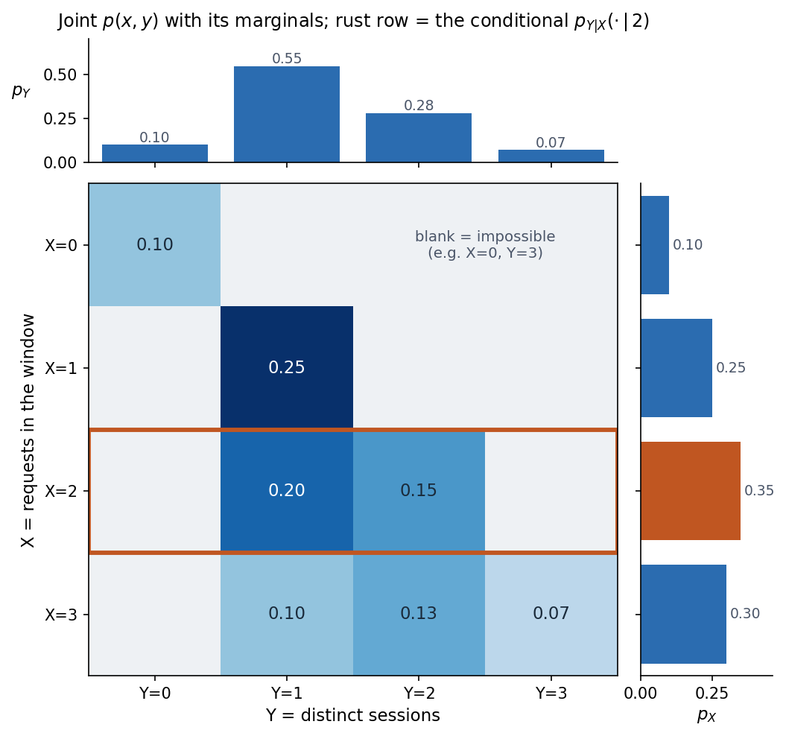

# Conditional Probability and Dependence

## Conditional Probability

So far a probability has been a number attached to an event, comprised of outcomes picked from the whole sample space $\Omega$. But most questions I actually care about are not asked against the whole world — they are asked *after I already know something*. What is the probability that a request is slow, **given** that it is peak hour? What is the probability that a page is a real incident, **given** that it fired at all? 

Lets consider a simple discrete sample space with just three possible outcomes - $\Omega = \{\omega_1, \omega_2, \omega_3\}$. Lets define two events $A = \{\omega_1, \omega_2\}$ and $B = \{\omega_2, \omega_3\}$. We know that $P(\Omega) = P(\{\omega_1, \omega_2, \omega_3\}) = 1$, and $P(A) = P(\{\omega_1, \omega_2\})$ and $P(B) = P(\{\omega_2, \omega_3\})$ have non-zero probabilities. Lets say we get some new information that event $B$ has happened, this means that either $\omega_2$ or $\omega_3$ has been realized. But once we know this, the sample space is no longer all of $\Omega$, it is now $B$. Strictly speaking I can still keep the sample space as $\Omega$ if I want, but its event space will have a bunch of $0$ probability events. The sure-thing is now $B$. If we use $P'$ to denote probability in this new post-$B$ world, then $P'(B) = 1$, i.e., $P'(\{\omega_2, \omega_3\}) = 1$. But what will be the new probabilities of the remaining events in the event space? To answer that, we need to realize that while we know that $B$ happened, we don't know anything else about any of the other events, so their new probabilities w.r.t each other will still be the same as before, although their absolute values might be different. If I have any two events $E_1$ and $E_2$, then -
$$
\frac{P(E_1)}{P(E_2)} = \frac{P'(E_1)}{P'(E_2)}
$$
If I multiply the old probabilities by some constant, I should be able to get the new probabilities.
$$
cP(E_1) = P'(E_1) \\
cP(E_2) = P'(E_2) \\
$$
And what should this constant be? By the above logic I can say that $cP(B) = P'(B)$, but I already know that $P'(B) = 1$, so it follows that -
$$
c = \frac{1}{P(B)}
$$
Does this mean that I can take any event from the old space and divide its old probability by $P(B)$ to get its new post-B probability? Not quite. If I have an event $E$ comprised of bunch of outcomes, only the outcomes that overlap with $B$ will show up in the post-B world, i.e., $E$ in the post-B world is really $E \cap B$ from the old world, so its probabiity in the new world is given by -
$$
P'(E) = \frac{P(E \cap B)}{P(B)}
$$
For events that don't have any overlap with $B$, the intersection will produce the $\emptyset$ whose probability is always $0$. E.g., the probability of the singleton event $\{\omega_1\}$ in the new world will be -
$$
P'(\{\omega_1\}) = \frac{P(\{\omega_1\} \cap B)}{P(B)} = 0
$$
On the other hand, the new probability of event $A$ will be -
$$
P'(A) = \frac{P(A \cap B)}{P(B)} = \frac{P(\{\omega_2\})}{P(B)}
$$
So far we have been calling the post-B world's probability measure as $P'$, but $P'(\cdot) = P(\cdot \mid B)$, which is the correct mathematical notation. And it follows all the three rules of a probability measure, especially the "sure thing" rule $P(B \mid B) = 1$. With this new notation, read as "probability of A given B" -
$$
P(A \mid B) = \frac{P(A \cap B)}{P(B)}
$$

This also gives us the familiar product rule -
$$
P(A \cap B) = P(A \mid B) \; P(B) = P(B \mid A) \; P(A)
$$
Concretely, for the die: $P(X = 2 \mid \text{even}) = P(\{2\} \cap \{2,4,6\}) / P(\{2,4,6\}) = (1/6)/(1/2) = 1/3$. Knowing the roll is even collapses six equally likely faces down to three, and $2$ is one of them. 

In the QPS experiment, lets say we have also been capturing the timestamp at the beginning of the 1-second window. We have two random variables - $X$ which measures the number of requests, and $T$ which measures the timestamp. With these two variables we can define two different events (from the same sample space):

* *overloaded*: Windows when the server was overloaded, i.e., $\{\omega: X(\omega) > K\}$, where $K$ is the saturation load for the web server.
* *peak*: Windows that fall in the peak-hours band, i.e., in the 6 hour window between 10AM and 4PM, i.e., $\{\omega: 10AM \le T(\omega) \le 4PM\}$.

Lets say we have a log of several full days' traffic chopped up into 1-second windows. I randomly sample a 1-second window from this log. Probability that the sampled window is in the peak band is $P(\text{peak}) = \frac{6}{24} = 0.25$. Lets say that after counting all the overloaded windows, I determine that $P(\text{overloaded}) = 0.2$. Now, if I select a peak window, what is the probability that it was overloaded? The question I am asking is - what is the value of $P(\text{overloaded} \mid \text{peak})$?
$$
P(\text{overloaded} \mid \text{peak}) = \frac{P(\text{overloaded} \cap \text{peak})}{P(\text{peak})}
$$
Lets say empirically we calculate that $P(\text{overloaded} \cap \text{peak}) = 0.15$.
$$
P(\text{overloaded} \mid \text{peak}) = \frac{P(\text{overloaded} \cap \text{peak})}{P(\text{peak})} = \frac{0.15}{0.25} = 0.6
$$
So even though the probability of the sever getting overloaded is $0.2$, the probability that it is overloaded during peak hours is 3X the overall rate!

> How did I choose the numbers 0.2 and 0.15? First off, $P(\text{overloaded} \cap \text{peak}) \le P(\text{peak})$ because $\text{overloaded} \cap \text{peak} \subseteq \text{peak}$, so I have to choose some value less than $0.25$. I arbitrarily chose $0.15$ to make the arithmetic neat. Next, by similar logic $P(\text{overloaded}) \ge P(\text{overloaded} \cap \text{peak})$, so the lower bound is $0.15$. Now $P(\text{overloaded}) = P(\text{overloaded} \cap \text{peak}) + P(\text{overloaded} \cap \text{peak}^c)$. $P(\text{overloaded} \cap \text{peak}^c) < P(\text{peak}^c)$. $P(\text{peak}^c) = 0.75$. So the upper bound of $P(\text{overloaded}) = 0.15 + 0.75 = 0.9$. I chose $0.2$ as the number between $(0.15, 0.9)$. 
>
> Further, I don't actually use $P(\text{overloaded}) = 0.2$ anywhere in the calculations, it is just there to show the contrast with 0.6.

## Joint, Marginal, and Conditional Distributions

Lets remind ourselves that probability is defined for events, i.e., a set of outcomes, and it indicates the chance that any one of the outcomes in that set is actually realized. We already saw an example of **joint probability** - $P(\text{overloaded} \cap \text{peak})$ which was the probability of getting a window that was both in peak hours and had the server overloaded. Conceptually, this is nothing new. At the end of the day, we are still finding the probability of a set of outcomes. What makes this a "joint probability" is that the set was built by two intersecting events. Just like probability distributions, joint probability distributions for discrete spaces can be represented in a table. Continuing the example from above, we can build a full joint probability distribution of these two events:

|                                               | ${\textbf{peak} \; \mathbf {P}}$ | $\textbf{not peak} \; \mathbf {\neg P}$ | Marginal                     |
| --------------------------------------------- | -------------------------------- | --------------------------------------- | ---------------------------- |
| $\textbf{overloaded} \; \mathbf {O}$          | $P(O \cap P) = 0.15$             | $P(O \cap \neg P) = 0.05$               | $\mathbf {P(O)= 0.20}$       |
| $\textbf{not overloaded} \; \mathbf {\neg O}$ | $P(\neg O \cap P) = 0.10$        | $P(\neg O \cap \neg P) = 0.70$          | $\mathbf {P(\neg O) = 0.80}$ |
| **Marginal**                                  | $\mathbf {P(P) = 0.25}$          | $\mathbf {P(\neg P) = 0.75}$            | $\mathbf {P(\Omega) = 1}$    |

The probability of a single event $O$ or $P$ is called the marginal probability because we can calculate these at the margins of the table. To get the probability of $O$ I just have to sum its row, i.e., I am summing over all disjoint $P$ events. In this case there are only two disjoint events - $P$ and $\neg P$.

Instead of working with events, we can also work with random variables, which as you may remember are simply a way to group outcomes into sets, i.e., they define a family of events. Consider the two random variables we defined earlier in Module 1, $X$ is the number of requests, and $Y$ is the number of sessions, which is calculated as the number of distinct client IPs in the 1-second window. We know that $P(X = x)$ is shortform for the more pedantic $P(\{\omega: X(\omega) = x\})$. Similarly $P(X = x, Y = y)$ is the shortform for $P(\{\omega: X(\omega) = x\} \cap \{\omega: Y(\omega) = y\})$. Same concept of joint probabilities, we are just constructing our events from random variables. Lets construct the joint distribution for a max of 3 requests. We cannot have  more sessions than requests, so we will have a max of 3 sessions as well.

|                  | Y = 0            | Y = 1            | Y = 2            | Y = 3            | $\mathbf {P(X)}$ |
| ---------------- | ---------------- | ---------------- | ---------------- | ---------------- | ---------------- |
| **X = 0**        | $0.10$           | -                | -                | -                | $\mathbf {0.10}$ |
| **X = 1**        | -                | $0.25$           | -                | -                | $\mathbf {0.25}$ |
| **X = 2**        | -                | $0.20$           | $0.15$           | -                | $\mathbf {0.35}$ |
| **X = 3**        | -                | $0.10$           | $0.13$           | $0.07$           | $\mathbf {0.30}$ |
| $\mathbf {P(Y)}$ | $\mathbf {0.10}$ | $\mathbf {0.55}$ | $\mathbf {0.28}$ | $\mathbf {0.07}$ | $\mathbf {1.0}$  |

The dashes are impossible events, e.g., I cannot have $0$ requests but $3$ sessions, or $0$ sessions but $3$ requests.

The joint p.m.f can be represented as $p(x, y) = P(X = x, Y = y)$. The individual p.m.fs can be $p_X(x) = P(X = x)$ and $p_Y(y) = P(Y = y)$. From the joint p.m.f I can recover either variable on its own by **summing out** the one I do not care about:
$$
p_X(x) = \sum_y p(x, y), \qquad p_Y(y) = \sum_x p(x, y).
$$
This is called the **marginal** distribution, and the name is literal: if you write the joint as a table, the row sums and column sums land in the *margins* of that table. Summing out a variable is called **marginalizing** it. (For continuous variables it is the same move with an integral: $f_X(x) = \int f(x,y)\,dy$.)

And if I fix one variable and ask about the other, I am back to conditional probability — applied to distributions:
$$
p_{Y \mid X}(y \mid x) = \frac{p(x, y)}{p_X(x)}.
$$
If I want to find out the conditional probability distribution of $Y$ when $X = 2$, I just slice that row out and rescale it.

|           | Y = 0 | Y = 1                             | Y = 2                             | Y = 3 | $\mathbf {P(X)}$                  |
| --------- | ----- | --------------------------------- | --------------------------------- | ----- | --------------------------------- |
| **X = 2** | -     | $\frac{0.20}{0.35} = \frac{4}{7}$ | $\frac{0.15}{0.35} = \frac{3}{7}$ | -     | $\mathbf {\frac{0.35}{0.35} = 1}$ |

Similarly if I were conditioning on $Y$, I'd just slice that column out and rescale.

## Independence

Two random variables are **independent** when knowing one tells you nothing about the other. If I know that $Y = y$ happened, that does not change the probability of $X = x$ happening (or vice-versa).  $P(X = x \mid Y = y) = P(X = x)$, then $X$ and $Y$ are independent of each other. Of course this means that $P(Y = y \mid X = x) = P(Y = y)$ as well. Mathematically and using p.m.fs:
$$
X \perp Y \iff p(x, y) = p_X(x)\, p_Y(y) \quad \text{for all } x, y.
$$

Equivalently — and this is the version that matches intuition — the conditional equals the marginal: $p_{Y \mid X}(y \mid x) = p_Y(y)$. Conditioning on $X$ does not move the distribution of $Y$ at all.

Two separate coin flips are independent: the first coin says nothing about the second. QPS and sessions are emphatically **not** — $Y \le X$ means large $Y$ rules out small $X$ entirely, so the joint cannot possibly factor (the triangular support alone is proof: a product of marginals would fill a rectangle).

## Conditional Independence

Here is the subtle one, and it is worth slowing down on because it is the seed of every graphical model later. $X$ and $Y$ are **conditionally independent given $Z$** when, *once you know $Z$*, they carry no further information about each other:
$$
X \perp Y \mid Z \iff p(x, y \mid z) = p(x \mid z)\, p(y \mid z) \quad \text{for all } x, y, z.
$$

The canonical case is a **common cause**. Suppose the server load $Z$ drives both the request rate (QPS) and the latency: heavy load tends to push both up. Then measured across all conditions, QPS and latency are correlated — see one high and you should bet the other is high too. But that correlation is entirely routed *through* the load. If I hold the load fixed at some level $z$ and look only within that slice, the residual wiggle in QPS and the residual wiggle in latency may have nothing to do with each other. They are dependent marginally, conditionally independent given $Z$.

The trap to avoid: conditional independence neither implies nor is implied by ordinary (marginal) independence. Conditioning on the right thing can *create* independence (the common-cause case above) and conditioning on the wrong thing can *destroy* it (conditioning on a common effect — the "explaining away" pattern). Which is exactly why, later, we will want a picture — a graph — to keep track of what is independent of what given what.

## Conditional Expectation

Once I have a conditional distribution, I can take its mean like any other distribution:
$$
E[Y \mid X = x] = \sum_y y \; p_{Y \mid X}(y \mid x).
$$
This is one number for each value $x$. Letting $x$ vary, $E[Y \mid X]$ becomes a **function of $X$** — and since $X$ is a random variable, so is $E[Y \mid X]$. That is the mental step worth getting used to: the conditional expectation is not a single number, it is a new random variable that reads off $X$ and returns the average $Y$ you should expect.

For the QPS joint, each request independently belongs to a new session with some probability $q$, so given $X = x$ requests, the expected number of distinct sessions is $E[Y \mid X = x] = q\,x$ — a straight line in $x$.

![Scatter of (X, Y) samples with E[Y given X] = q x drawn through them; the conditional expectation is the mean of each vertical slice and the best predictor of Y from X.](./imgs/m3-conditional-expectation.png)

The line threads the mean of each vertical strip of points, which is what "mean of the conditional distribution" looks like when you plot it. And there is a deeper reason this object matters, one that lands for anyone comfortable with linear algebra: **$E[Y \mid X]$ is the best predictor of $Y$ from $X$ in the mean-squared sense.** Among all functions $g(X)$, the one that minimizes $E[(Y - g(X))^2]$ is $g(X) = E[Y \mid X]$. Geometrically it is an **orthogonal projection** — project the random variable $Y$ onto the subspace of all functions of $X$, and the shadow you get is the conditional expectation; the prediction error is orthogonal to everything you could have built from $X$. That projection picture is precisely what regression is doing, and we will cash it out in the regression module.

One identity falls straight out and will connect to the next section — the **law of total expectation** (or "tower rule"):
$$
E[Y] = E\big[\,E[Y \mid X]\,\big].
$$
To get the overall average of $Y$, average the per-$x$ conditional averages, weighting each by how likely that $x$ is. That is "average over cases," and it is the expectation-level version of the theorem below.

## The Total Probability Theorem

Suppose I chop the sample space into a set of mutually exclusive, exhaustive cases $A_1, A_2, \dots, A_n$ (a **partition** — exactly the sample-space conditions from Module 1, now applied to events). Then any event $B$ can be reached only through one of the cases, so its probability is the sum of the case-by-case probabilities, each weighted by how likely the case is:
$$
P(B) = \sum_{i} P(B \mid A_i)\, P(A_i).
$$
This is just marginalization wearing different clothes: I am summing the joint $P(B \cap A_i) = P(B \mid A_i)P(A_i)$ over all the $A_i$ to marginalize the $A_i$ away and land on $P(B)$ alone. Concretely, the overall probability a request times out is the timeout rate during peak times the fraction of peak traffic, plus the timeout rate off-peak times the fraction of off-peak traffic — I average the conditional timeout rates over the traffic mix.

## Bayes' Theorem

Everything above now assembles into the one result that makes conditioning genuinely powerful — the ability to **reverse** the direction of conditioning. Start from the multiplication rule written both ways, $P(A \cap B) = P(B \mid A)P(A) = P(A \mid B)P(B)$, and solve for the conditional you want:
$$
P(A \mid B) = \frac{P(B \mid A)\, P(A)}{P(B)},
$$
where the denominator $P(B)$ is usually filled in by the total-probability theorem. The pieces have names worth stating plainly:

- $P(A)$ is the **prior** — what I believed about $A$ before seeing the evidence.
- $P(B \mid A)$ is the **likelihood** — how probable the evidence $B$ is if $A$ were true.
- $P(B)$ is the **evidence** (or marginal likelihood) — how probable the evidence is overall, averaged across the cases.
- $P(A \mid B)$ is the **posterior** — my updated belief about $A$ after seeing $B$.

The reason this is more than algebra is that the direction I *have* and the direction I *want* are usually opposite. My alerting system is characterized in the forward direction: given a real incident, how often does it page ($P(\text{page} \mid \text{incident})$, the sensitivity)? But at 3am, staring at a page, I want the reverse: given that it paged, is this real ($P(\text{incident} \mid \text{page})$)? Bayes flips one into the other — and the flip depends on the **base rate** $P(\text{incident})$ in a way that is famously easy to get wrong.

Take a genuinely good detector — pages $90\%$ of real incidents, and only false-alarms $10\%$ of the time — but incidents are rare, say $5\%$ of the windows that could trigger it. Out of every $100$ windows: $5$ are incidents and about $4.5$ of those page; $95$ are quiet and about $9.5$ of *those* page anyway. So of the $\approx 14$ pages that fire, only $4.5$ are real — the posterior $P(\text{incident} \mid \text{page}) \approx 32\%$. A "$90\%$ accurate" detector produces pages that are wrong more often than right, purely because the base rate is low and there is so much more quiet traffic to throw off false alarms. The mosaic makes it visual: the false-alarm strip, though short, is *wide*, and wide-and-short beats narrow-and-tall.

That is why these two theorems belong here and not back in Module 2: both are statements about conditional probability, and neither means anything until $P(A \mid B) = P(A \cap B)/P(B)$ is on the table first. With that in hand, the whole machinery of updating beliefs from evidence — which is what the rest of the course is really about — is just Bayes' theorem applied over and over.
